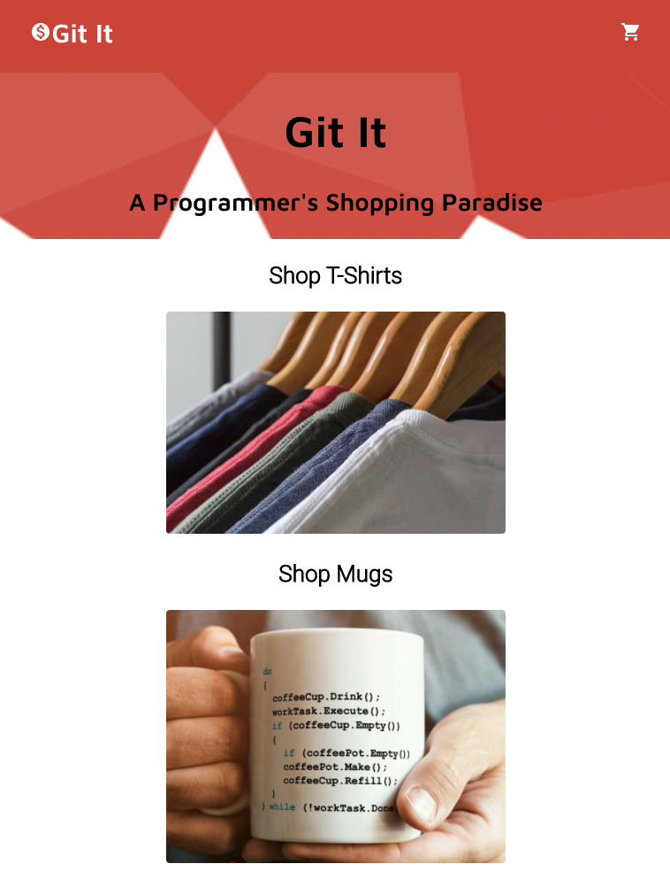
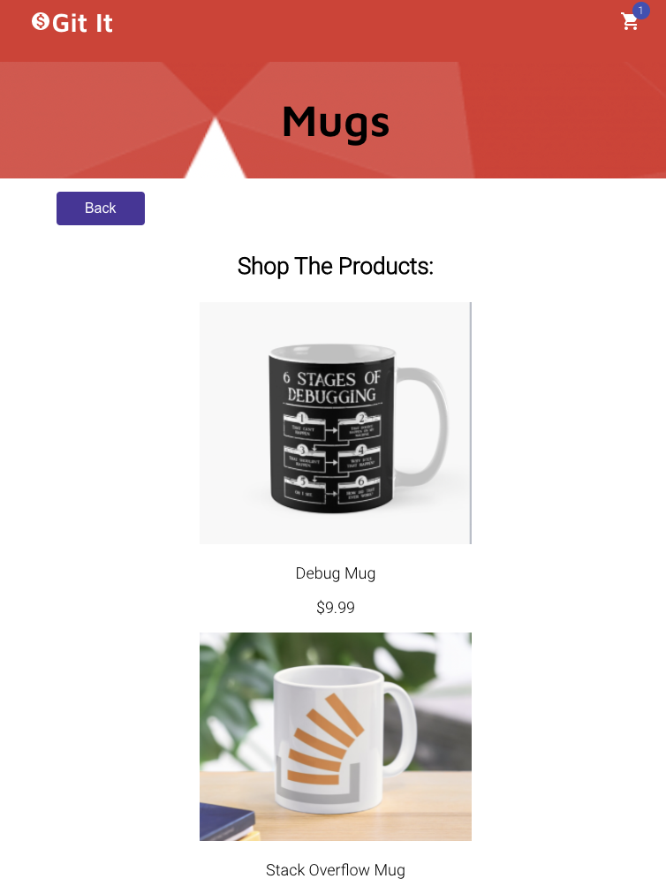
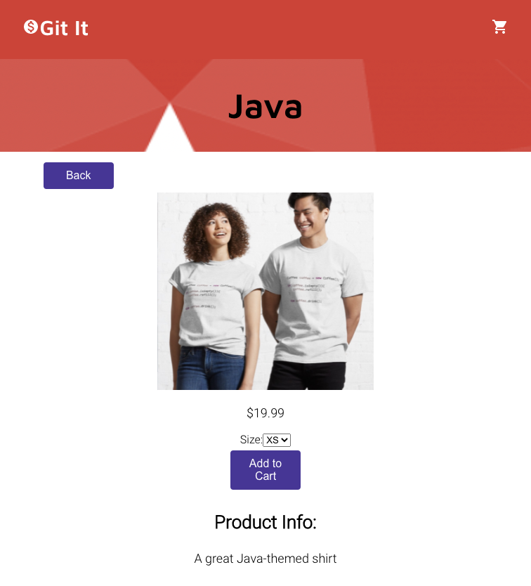
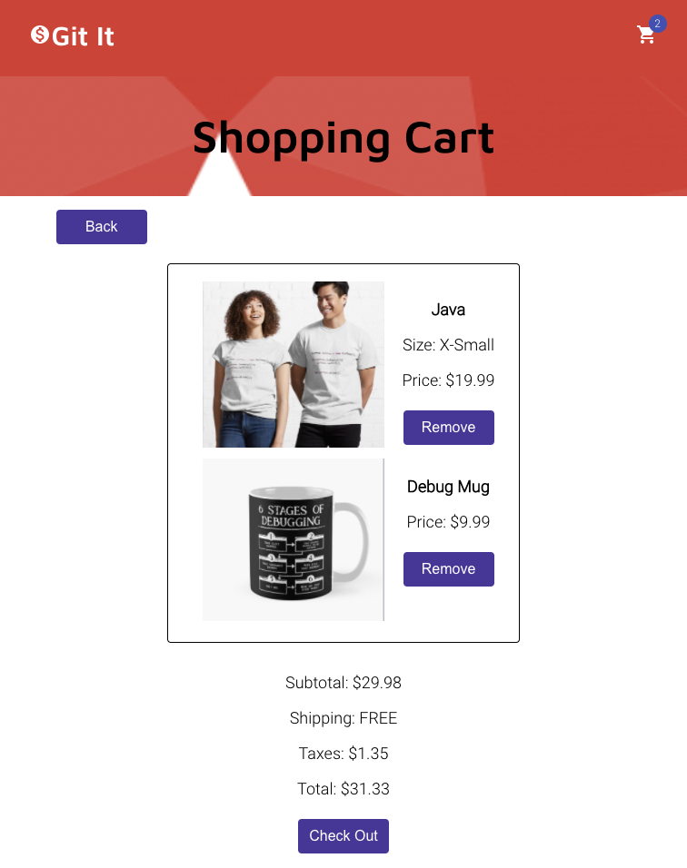

# Git It

## Summary

Git It is a full-stack PERN app designed as a mock coding-related merch site.

The Git It client-side allows users to view products, add and delete items from their shopping cart and complete a demo checkout process. The connected API was also written by me and can be viewed [here](https://github.com/SabrinaSides/git-it-server).

## See the App Live

[Check It Out Here](https://git-it-sabrinasides.vercel.app/)

## Tech Stack

**Client:** React, JavaScript, CSS

**Server:** Node, Express, PostgreSQL

[View the Server Repo](https://github.com/SabrinaSides/git-it-server)

## Screenshots

### Home Page

### Category Page: Mugs

### Product Page

### Shopping Cart

